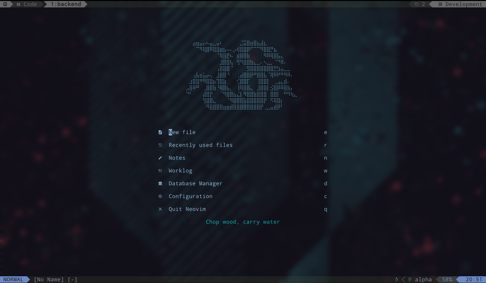

# Tmux Statusline

Personalized Tmux statusline based on [wfxr/tmux-power](https://github.com/wfxr/tmux-power/tree/master).

## Installation

```
set -g @plugin 'jpinilloslr/tmux-statusline'
```

## Required extensions

```
set -g @plugin 'tmux-plugins/tmux-battery'
set -g @plugin 'tmux-plugins/tmux-cpu'
set -g @plugin 'tmux-plugins/tmux-net-speed'
set -g @plugin 'olimorris/tmux-pomodoro-plus'
```


